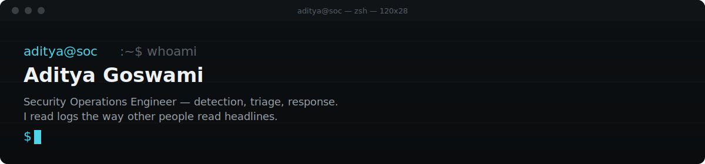

  

 

<!--
  EDIT THIS BLOCK YOURSELF — this is the most important paragraph on the whole page.
  Replace it with your actual point of view in your own words.
-->
> Most SOC dashboards are built to look busy, not to catch anything. I care more about the ten log lines that actually mattered than the thousand that didn't.

 

## 01 — What I Do

Associate SOC Engineer, based in Vadodara, India. I work in the space between an alert firing and someone actually understanding what happened — triage, correlation, and turning raw noise into a decision someone can act on.

 

## 02 — By the Numbers

| 02+ | 40+ | 01 | 07 |
|:---:|:---:|:---:|:---:|
| Years hands-on SOC ops | Certifications — SOC · VAPT · DFIR · GRC · Cloud | Gold Medal — Cyber Forensics (BSc) | Public projects, all independently built |

**Education:** MSc Cybersecurity · BSc Forensic Science (Cyber Forensic specialization, Gold Medal)

 

## 03 — Stack

 

## 04 — Projects

Each of these was built to answer a specific question I had, not to pad a list.

| # | Project | What it answers |
|:---:|---|---|
| 01 | [SOC-Lab-Open-Source-Setup](https://github.com/Aditya-Sec/SOC-Lab-Open-Source-Setup) | Can a full detection-and-response pipeline be built entirely on open-source tooling, end to end? |
| 02 | [ReconVeritas](https://github.com/Aditya-Sec/ReconVeritas-Automated-Recon-Tool) | How much of manual recon can be safely automated into one modular workflow? |
| 03 | [SOC-Incident-Case-Study](https://github.com/Aditya-Sec/SOC-Incident-Case-Study) | What does a real incident look like end-to-end — detection, response, and the lesson learned? |
| 04 | [RedTeam-WAF-Detection-Bypass-Lab](https://github.com/Aditya-Sec/RedTeam-WAF-Detection-Bypass-Lab) | If I were attacking my own detections, where would they break? |
| 05 | [Kibana-SIEM-Dashboard-Demo](https://github.com/Aditya-Sec/Kibana-SIEM-Dashboard-Demo) | What does a correlation rule look like from raw log to dashboard alert? |
| 06 | [SOC-Alert-Notifier](https://github.com/Aditya-Sec/SOC-Alert-Notifier) | Can alert routing be automated without losing the analyst's judgment in the loop? |
| 07 | [Wireshark-HTTP-Credential-Capture](https://github.com/Aditya-Sec/Wireshark-HTTP-Credential-Capture) | What does an attacker actually see on unencrypted traffic — hands-on, not theoretical? |

 

## 05 — Currently

<!--INVESTIGATING:START-->
🔎 Nothing set yet — trigger the `update-investigating` workflow to set this line.
<!--INVESTIGATING:END-->

 

## 06 — Field Note

<!--CVE:START-->
_Not yet populated — runs on first scheduled workflow execution._
<!--CVE:END-->

 

## 07 — Latest Writing

<!--BLOG-POST-LIST:START-->
_Not yet populated — will populate automatically once your Medium RSS feed has posts._
<!--BLOG-POST-LIST:END-->

 

## 08 — Activity

  

 

## 09 — Elsewhere

