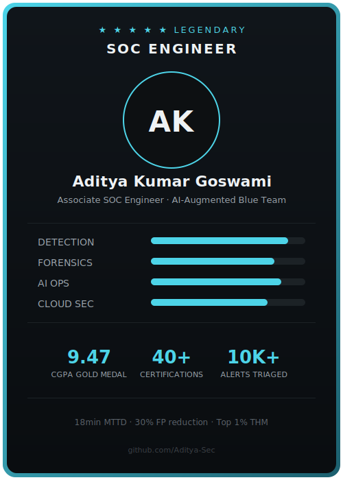

  

 

  

 

> Most SOC dashboards are built to look busy, not to catch anything. I care more about the ten log lines that actually mattered than the thousand that didn't.

 

## 01 — What I Do

Associate SOC Engineer at Investis Digital, Vadodara, India. I work in the space between an alert firing and someone actually understanding what happened — triage, correlation, and AI-augmented detection that turns raw noise into a decision someone can act on.

 

## 02 — Verified Impact

| 10K+ | 18 min | 30% | 5× |
|:---:|:---:|:---:|:---:|
| Alerts triaged | Mean time to detect *(down from 4 hrs)* | False positives cut via ML tuning | Faster detection rule development |

| 9.47 | 40+ | Top 1% | 8+ |
|:---:|:---:|:---:|:---:|
| CGPA — Gold Medal, Cyber Forensics | Verified certifications | TryHackMe global ranking | HackTheBox machines pwned |

Every number above is drawn directly from real SOC work at Investis Digital and independently verifiable certifications — nothing here is aspirational.

 

## 03 — Stack

 

## 04 — Projects

| # | Project | What it answers |
|:---:|---|---|
| 01 | [Sentinel-Detection-Response-Pack](https://github.com/Aditya-Sec/Sentinel-Detection-Response-Pack) | Can six ATT&CK-mapped detections, two SOAR playbooks, and a cloud posture check ship as deployable code, not a lab screenshot? |
| 02 | [CyberShield-AI](https://github.com/Aditya-Sec/CyberShield-AI) | Can phishing/malware triage be scored transparently — rule-by-rule — instead of hidden behind a black-box model? |
| 03 | [SOC-Lab-Open-Source-Setup](https://github.com/Aditya-Sec/SOC-Lab-Open-Source-Setup) | Can a full detection-and-response pipeline be built entirely on open-source tooling, end to end? |
| 04 | [ReconVeritas](https://github.com/Aditya-Sec/ReconVeritas-Automated-Recon-Tool) | How much of manual recon can be safely automated into one modular workflow? |
| 05 | [SOC-Incident-Case-Study](https://github.com/Aditya-Sec/SOC-Incident-Case-Study) | What does a real incident look like end-to-end — detection, response, and the lesson learned? |
| 06 | [RedTeam-WAF-Detection-Bypass-Lab](https://github.com/Aditya-Sec/RedTeam-WAF-Detection-Bypass-Lab) | If I were attacking my own detections, where would they break? |
| 07 | [Kibana-SIEM-Dashboard-Demo](https://github.com/Aditya-Sec/Kibana-SIEM-Dashboard-Demo) | What does a correlation rule look like from raw log to dashboard alert? |
| 08 | [SOC-Alert-Notifier](https://github.com/Aditya-Sec/SOC-Alert-Notifier) | Can alert routing be automated without losing the analyst's judgment in the loop? |
| 09 | [Wireshark-HTTP-Credential-Capture](https://github.com/Aditya-Sec/Wireshark-HTTP-Credential-Capture) | What does an attacker actually see on unencrypted traffic — hands-on, not theoretical? |

 

## 05 — The Card

A shareable snapshot, built for LinkedIn, not a filing cabinet.

  

 

## 06 — Activity

  

 

  
  

  
  

 

## 07 — Elsewhere

